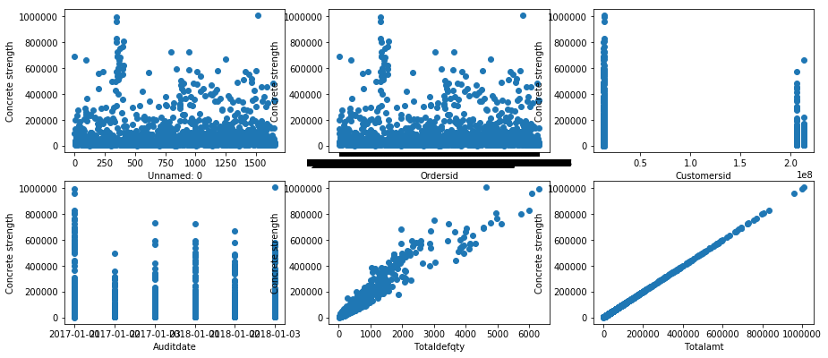
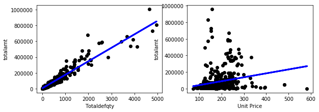

```python
import pandas as pd
import matplotlib.pyplot as plt
from sklearn.cross_validation import train_test_split
```


```python
data = pd.read_csv('data.csv')
```


```python
print(len(data))
```

    1658
    


```python
data.head()
```


<div>
<style scoped>
    .dataframe tbody tr th:only-of-type {
        vertical-align: middle;
    }

    .dataframe tbody tr th {
        vertical-align: top;
    }

    .dataframe thead th {
        text-align: right;
    }
</style>
<table border="1" class="dataframe">
  <thead>
    <tr style="text-align: right;">
      <th></th>
      <th>Unnamed: 0</th>
      <th>ordersid</th>
      <th>customersid</th>
      <th>auditdate</th>
      <th>totaldefqty</th>
      <th>totalamt</th>
      <th>unit_price</th>
    </tr>
  </thead>
  <tbody>
    <tr>
      <th>0</th>
      <td>0</td>
      <td>BJ1004924073</td>
      <td>13001527</td>
      <td>2017-01-01</td>
      <td>656.0</td>
      <td>96356.18</td>
      <td>146.884</td>
    </tr>
    <tr>
      <th>1</th>
      <td>1</td>
      <td>BJ1004924086</td>
      <td>13400327</td>
      <td>2017-01-01</td>
      <td>4560.0</td>
      <td>694180.60</td>
      <td>152.233</td>
    </tr>
    <tr>
      <th>2</th>
      <td>2</td>
      <td>BJ1004924117</td>
      <td>13005327</td>
      <td>2017-01-01</td>
      <td>1299.0</td>
      <td>196480.20</td>
      <td>151.255</td>
    </tr>
    <tr>
      <th>3</th>
      <td>3</td>
      <td>BJ1004924262</td>
      <td>13401521</td>
      <td>2017-01-01</td>
      <td>949.0</td>
      <td>126786.74</td>
      <td>133.6</td>
    </tr>
    <tr>
      <th>4</th>
      <td>4</td>
      <td>BJ1004924268</td>
      <td>13400722</td>
      <td>2017-01-01</td>
      <td>140.0</td>
      <td>22651.64</td>
      <td>161.797</td>
    </tr>
  </tbody>
</table>
</div>


```python
for i in range(len(data)):
    data['unit_price'].iloc[i] = data['totalamt'].iloc[i] / data['totaldefqty'].iloc[i] 
```

    C:\Program Files\Anaconda3\lib\site-packages\pandas\core\indexing.py:189: SettingWithCopyWarning: 
    A value is trying to be set on a copy of a slice from a DataFrame
    
    See the caveats in the documentation: http://pandas.pydata.org/pandas-docs/stable/indexing.html#indexing-view-versus-copy
      self._setitem_with_indexer(indexer, value)
    


```python
data['unit_price'] = None
```


```python
data = data.drop(['unit-price'],axis=1)
```


```python
plt.figure(figsize=(15,10))
plot_count = 1
for feature in list(data.columns)[:-1]:
        plt.subplot(3,3,plot_count)
        plt.scatter(data[feature], data['totalamt'])
        plt.xlabel(feature.replace('_',' ').title())
        plt.ylabel('Concrete strength')
        plot_count+=1

plt.show()
```





```python
%matplotlib
```

    Using matplotlib backend: Qt5Agg
    


```python
def split_train_test(data, feature, train_index=0.7):

    train, test = train_test_split(data, test_size = 1-train_index)

    if type(feature) == list:
        x_train = train[feature].as_matrix()
        y_train = train['totalamt'].as_matrix()

        x_test = test[feature].as_matrix()
        y_test = test['totalamt'].as_matrix()

    else:
        x_train = [[x] for x in list(train[feature])]
        y_train = [[x] for x in list(train['totalamt'])]

        x_test = [[x] for x in list(test[feature])]
        y_test = [[x] for x in list(test['totalamt'])]

    return x_train, y_train, x_test, y_test
```


```python
plt.figure(figsize=(15,7))
plot_count = 1

for feature in ['totaldefqty', 'unit_price']:
    data_tr = data[['totalamt', feature]]
    data_tr=data_tr[(data_tr.T != 0).all()]

    x_train, y_train, x_test, y_test = split_train_test(data_tr, feature)

    # Create linear regression object
    regr = LinearRegression()

    # Train the model using the training sets
    regr.fit(x_train, y_train)
    y_pred = regr.predict(x_test)

    # Plot outputs
    plt.subplot(2,3,plot_count)

    plt.scatter(x_test, y_test,  color='black')
    plt.plot(x_test, y_pred, color='blue',
             linewidth=3)
    plt.xlabel(feature.replace('_',' ').title())
    plt.ylabel('totalamt')

    print(feature, r2_score(y_test, y_pred))

    plot_count+=1

plt.show()
```

    totaldefqty 0.919923201124
    unit_price 0.0500565527679
    





```python

```
